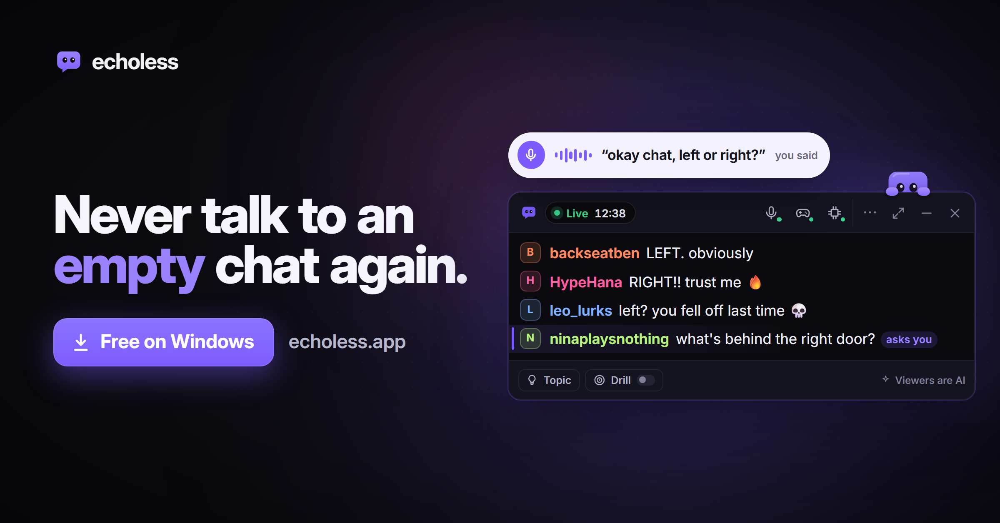
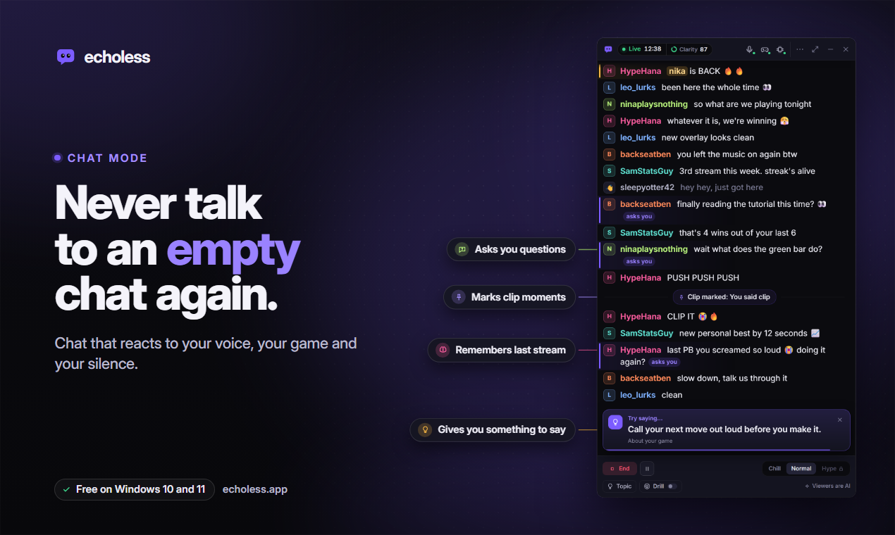
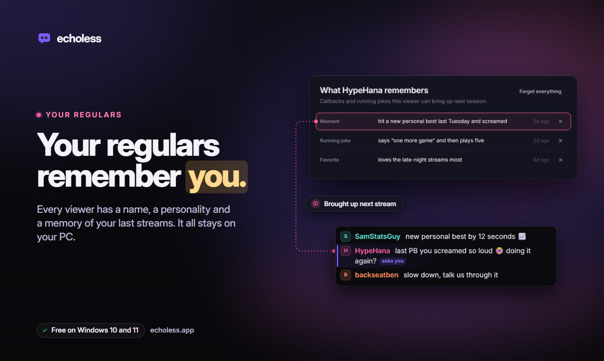
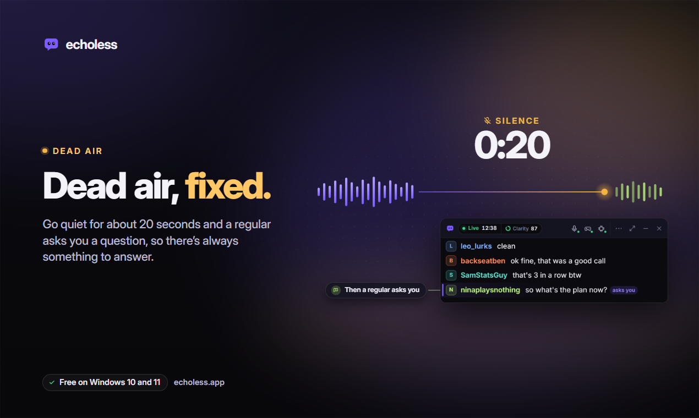
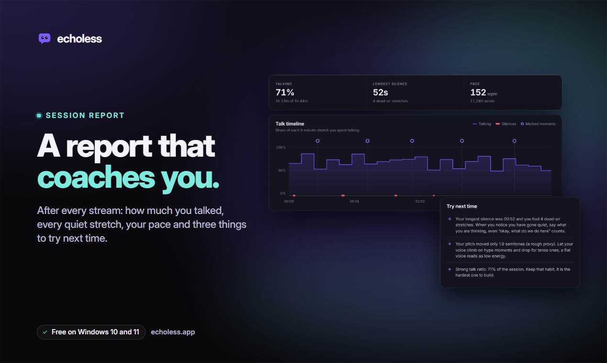
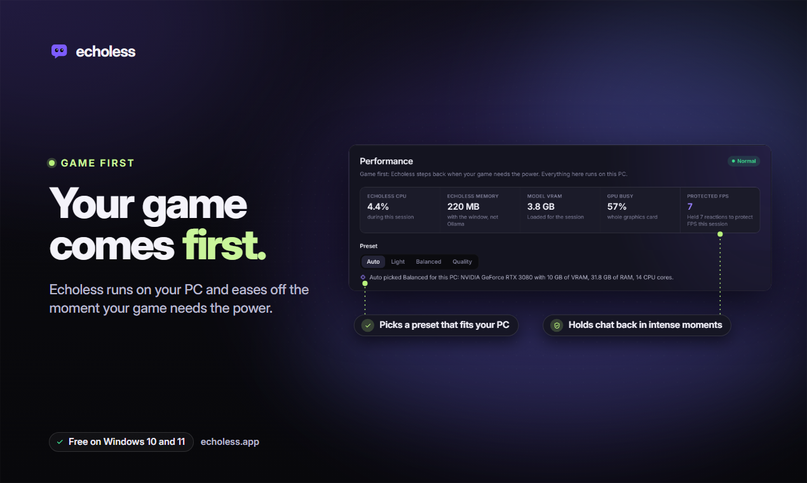
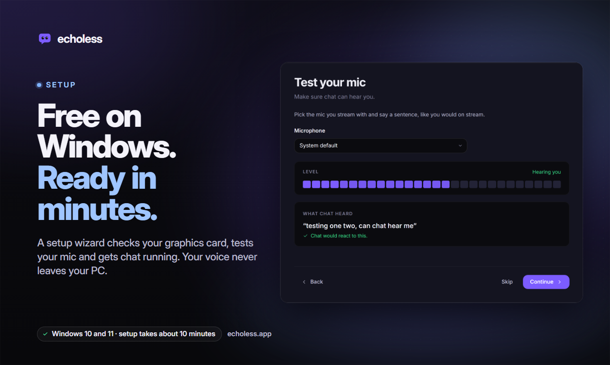
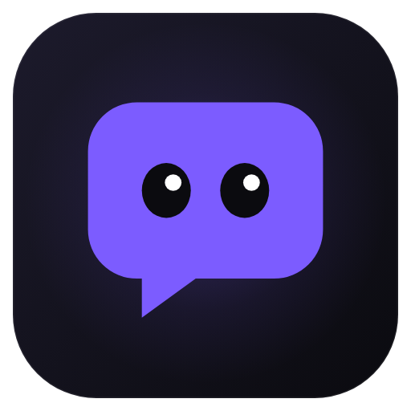

  

  
  
  

  <b>A private practice chat for small streamers.</b> 
  It reacts to your voice, your game and your silence, so you never talk to an empty chat again.

---

## Download

1. Download **[Echoless-Setup.exe](https://github.com/beeeegi/echoless-releases/releases/latest/download/Echoless-Setup.exe)**.
2. Run it. If Windows shows *"Windows protected your PC"*, click **More info → Run anyway**. The installer is new and not yet signed through the Microsoft Store.
3. Follow the short setup: pick your mic and your game. The setup downloads the free local AI model for you.

Echoless updates itself. Every version and its notes are on the [Releases](https://github.com/beeeegi/echoless-releases/releases) page.

## What it does

<table>
  <tr>
    <td width="50%"></td>
    <td width="50%"></td>
  </tr>
  <tr>
    <td><b>Chat that listens.</b> Talk and chat answers. Clutch a round and chat loses it.</td>
    <td><b>Regulars, not randoms.</b> They remember your name, your goals and your best plays.</td>
  </tr>
  <tr>
    <td></td>
    <td></td>
  </tr>
  <tr>
    <td><b>No more dead air.</b> Go quiet for 20 seconds and someone asks you something.</td>
    <td><b>A report card you'll actually read.</b> Talk time, silences and three tips after every stream.</td>
  </tr>
  <tr>
    <td></td>
    <td></td>
  </tr>
  <tr>
    <td><b>Game first.</b> It steps back when your game needs the power.</td>
    <td><b>Two-minute setup.</b> Mic, game, done.</td>
  </tr>
</table>

## Private by design

- Everything runs on your PC. Your voice and what you say never leave it.
- The chat is written by a local AI model and is always labeled **Viewers are AI**. It never posts to Twitch, YouTube or anywhere else.
- Only shows on stream if you add the window to OBS yourself.
- Anti-cheat safe: game events come from official game integrations; nothing reads game memory or injects into games.

Read the [privacy policy](https://echoless.app/privacy) and [terms](https://echoless.app/terms).

## Requirements

| | |
|---|---|
| System | Windows 10 (version 2004 or newer) or Windows 11, 64-bit |
| Processor | Any modern CPU with AVX2 |
| Memory | 16 GB recommended. Smaller PCs can run the Light performance preset |
| Graphics | Optional but recommended: any graphics card with Vulkan (NVIDIA, AMD or Intel) for fast speech recognition, and 8 GB of video memory for the best chat model |
| Disk | About 5 GB free for the local AI models |

Echoless picks the right preset for your PC on its own.

## Free and Pro

Echoless is free, with no time limit. [Pro](https://echoless.app/pricing) adds more for streamers who go live a lot: game events, screen vision, every regular plus your own, real chat mixed in, and more.

## Help and feedback

- Ideas and votes: [echoless.app/features](https://echoless.app/features)
- Reviews: [echoless.app/feedback](https://echoless.app/feedback)
- In the app: **Send feedback** and **Report a bug**

---

   
  Made by <a href="https://begi.dev">Begi</a>. This repository hosts the Echoless installers and release notes only; the app itself is closed source.

